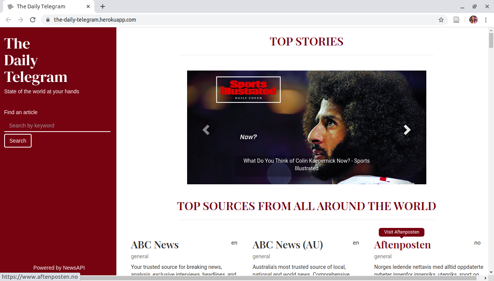

# The Daily Telegram

#### An application that allows users to list and preview news articles from various sources all around the world , 1/06/2020.
#### By Lorna Kamau

## Description
The application consumes the [NewsAPI](https://newsapi.org/) hence the application provides the following functionalities to users:
- View top stories. These are displayed on the landing page in carousel form. Each carousel item has a clickable link that allows the user to read the top story's article.
- Have access to news sources. The user has access to over 50 news sources of various categories. These are displayed on the landing page in card format for each news source.
- Search for articles from all around the world. The user can search for an article by keyword.

## Live link
Visit the application on https://the-daily-telegram.herokuapp.com/ .

## Development
To make advancements/modifications, follow these steps:

- Fork the repository
- Create a new branch (`git checkout -b improve-feature`)
- Make the appropriate changes in the files
- Add changes made
- Commit your changes (`git commit -am 'Improve feature'`)
- Push to the branch (`git push origin improve-feature`)
- Create a Pull Request 

## Technologies Used
Technologies used to develop this application:

1. Python v3.6
2. Flask 1.1.2
3. Flask-Bootstrap
4. HTML 
5. CSS

## Support and contact details

Should you be unable to access the website, have any recommendations and/or questions, feel free to email me:[kamaulorna@gmail.com](mailto:kamaulorna@gmail.com)

## To-do
1. Include pagination for API responses

## [License](https://github.com/lornakamau/the-daily-telegram/blob/master/LICENSE.md)

Copyright (c) 2020 [Lorna Kamau](https://github.com/lornakamau)  